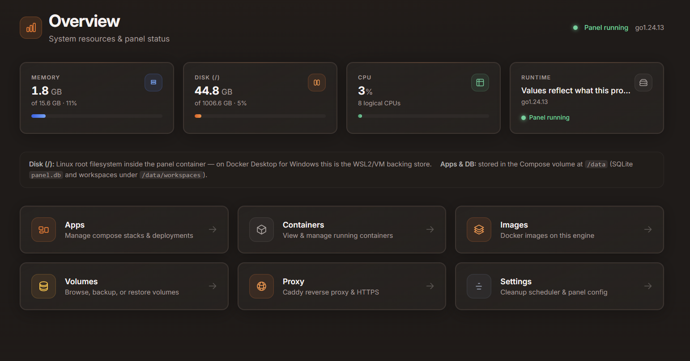
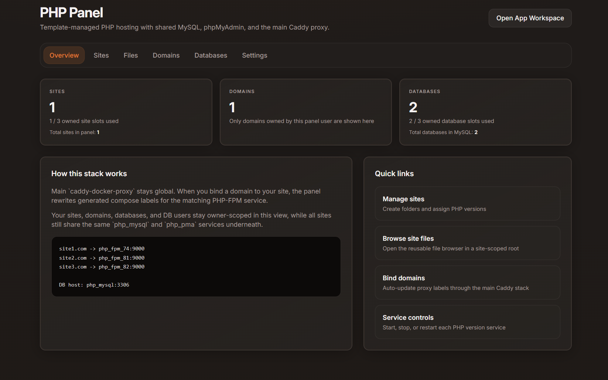

<div align="center">

# NextDeploy

**Self-hosted Docker deployment panel** — Compose stacks, automatic HTTPS, domains, and ops from one clean UI.

[](https://github.com/masudranaxpert/NextDeploy/releases)
[](https://hub.docker.com/r/masudranaxpert/nextdeploy)
[](LICENSE)
[](https://go.dev)
[](https://github.com/masudranaxpert/NextDeploy/tree/php-panel)

[GitHub](https://github.com/masudranaxpert/NextDeploy) · [Docker Hub](https://hub.docker.com/r/masudranaxpert/nextdeploy)



</div>

---

## Install (recommended)

One command downloads `docker-compose.yml`, creates `/data`, pulls images, starts **Caddy** + **panel**, optionally registers **systemd** auto-start, and installs **`nextdeploy-update`** / **`nextdeploy-logs`** helpers.

```bash
curl -fsSL https://raw.githubusercontent.com/masudranaxpert/NextDeploy/main/install.sh | sudo bash
```

Or clone the repo and run locally:

```bash
git clone https://github.com/masudranaxpert/NextDeploy.git
cd NextDeploy
sudo bash install.sh
```

### Install script options

| Option | Description |
|--------|-------------|
| `--domain <host>` | Shown in the success summary (configure DNS + HTTPS in the panel after install) |
| `--email <addr>` | Reminder for Let's Encrypt / ACME email (set in panel settings when ready) |
| `--dir <path>` | Install directory (default: `/opt/nextdeploy`) |
| `--data-dir <path>` | Host data path patched into compose (default: `/data`) |
| `--help` | Usage |

Examples:

```bash
sudo bash install.sh --domain panel.example.com --email admin@example.com
sudo bash install.sh --dir /srv/nextdeploy --data-dir /mnt/nextdeploy-data
```

After install, open **`http://<server-ip>:8080`** and create the first admin user.

---

## Uninstall

```bash
curl -fsSL https://raw.githubusercontent.com/masudranaxpert/NextDeploy/main/uninstall.sh | sudo bash
```

| Option | Description |
|--------|-------------|
| `--keep-data` | Keeps the data directory (workspaces, SQLite DB, uploads) |
| `--force` / `-f` | Skip the interactive `yes` confirmation |
| `--dir`, `--data-dir` | Must match your install if non-default |

```bash
sudo bash uninstall.sh --keep-data    # remove stack, keep /data
sudo bash uninstall.sh --force          # destructive, no prompt
```

---

## Helper commands

| Command | Purpose |
|---------|---------|
| `nextdeploy-update` | `docker compose pull` + `up -d` in the install directory |
| `nextdeploy-logs` | `docker compose logs -f --tail=100` |
| `systemctl status nextdeploy` | Systemd unit status (if enabled during install) |

---

## Manual quick start (Docker Compose only)

```bash
mkdir -p /data
curl -fsSL https://raw.githubusercontent.com/masudranaxpert/NextDeploy/main/docker-compose.yml \
  | docker compose -f - up -d
```

Or from a clone:

```bash
git clone https://github.com/masudranaxpert/NextDeploy.git
cd NextDeploy
docker compose up -d
```

```bash
docker pull masudranaxpert/nextdeploy:latest
```

---

## Features

- **Deploy apps** — ZIP or files, `docker-compose.yml`, one-click deploy
- **Automatic HTTPS** — Caddy + [caddy-docker-proxy](https://github.com/lucaslorentz/caddy-docker-proxy); Let's Encrypt / ZeroSSL via labels
- **Domains** — Per-app domains; panel merges Caddy labels into generated compose
- **File manager** — Browse, upload, edit, delete in the workspace
- **Live deploy logs** — Stream Compose output during deploys
- **Container logs** — Tail, filter levels, timestamps, download
- **Docker resources** — Containers, images, volumes (list / remove)
- **Scheduled cleanup** — Configurable prune of unused Docker data
- **Multi-user** — First-run admin; admins manage users and roles
- **Responsive UI** — Usable on phones and tablets
- **PHP hosting (PHP Panel template)**
  - PHP-FPM (7.4 / 8.1 / 8.2 / 8.3), MySQL 8, phpMyAdmin; multi-site folders under `sites/<slug>/public_html`
  - Per-user site and database limits; admin impersonation; scoped file browser (upload, ZIP, inline edit)
  - Domain Caddy labels with compose apply limited to **running** services; phpMyAdmin quick login; DNS status hints where configured



---

## Requirements

- **Linux** host (install script target); **Docker** 24+ and **Compose V2**
- Ports **80**, **443**, **8080** available (8080 for the panel UI by default)

---

## Configuration

Persistent state lives under the host **`/data`** bind mount (or your `--data-dir`): SQLite at `/data/panel.db`, workspaces under `/data/workspaces`.

| Variable | Default | Description |
|----------|---------|-------------|
| `DATA_DIR` | `/data` | Panel data root inside the container |
| `WORKSPACES_ROOT` | `/data/workspaces` | App file storage |
| `LISTEN_ADDR` | `:8080` | Panel HTTP listen |
| `PANEL_DEV` | `false` | Reload templates each request (dev only) |

---

## Caddy proxy

The panel generates Caddy labels and writes them into **`.nextdeploy.generated.compose.yml`**. No hand-written Caddyfile for app routing. For local-style names (`.localhost`, `.test`, …) the panel can use **internal TLS** when HTTPS is enabled on a domain.

---

## Releases

Tag push triggers CI: multi-arch image to Docker Hub, GitHub Release, tag housekeeping.

```bash
git tag v1.0.0
git push origin v1.0.0
```

---

## License

MIT — see [LICENSE](LICENSE).
