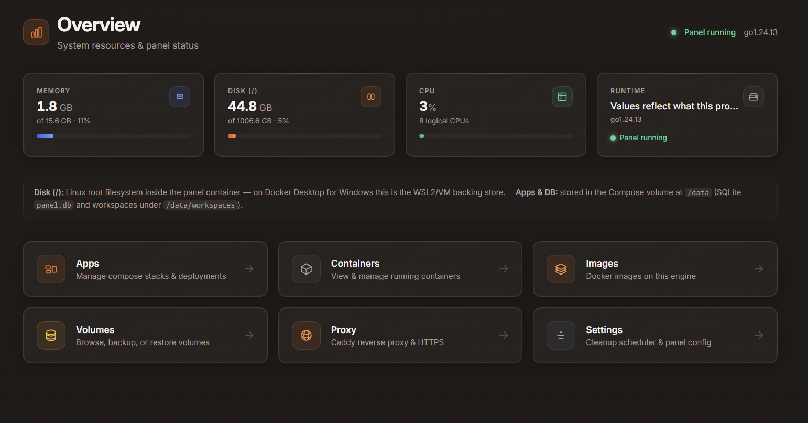

<div align="center">

# NextDeploy

**Self-hosted Docker deployment panel** — Compose stacks, automatic HTTPS, domains, and ops from one clean UI.

[](https://github.com/masudranaxpert/NextDeploy/releases)
[](https://hub.docker.com/r/masudranaxpert/nextdeploy)
[](LICENSE)
[](https://go.dev)

[GitHub](https://github.com/masudranaxpert/NextDeploy) · [Docker Hub](https://hub.docker.com/r/masudranaxpert/nextdeploy)



</div>

---

## Features

- **Deploy apps** — Upload a ZIP or files, configure `docker-compose.yml`, deploy with one click
- **Git deploys** — Connect a repository, deploy on push via webhook or the GitHub App
- **Development mode** — Mount the workspace into the container so edits apply without a rebuild ([details](#development-mode))
- **Automatic HTTPS** — Caddy reverse proxy with Let's Encrypt / ZeroSSL via labels ([caddy-docker-proxy](https://github.com/lucaslorentz/caddy-docker-proxy))
- **Domain routing** — Per-app domains; the panel generates Caddy labels and merges them into the generated compose file
- **File manager** — Browse, upload, view, and delete workspace files in the browser
- **Live deploy logs** — Real-time output while Docker Compose runs
- **Container logs** — Tail with level filtering, timestamps, and download
- **Docker resources** — List and remove containers, images, and volumes
- **Scheduled cleanup** — Auto-prune unused Docker data on a configurable interval
- **Multi-user auth** — First-run admin; admins manage users, roles, and per-user resource limits
- **Panel migration** — Export selected apps to a `.nd-migrate` bundle and restore on another VPS ([details](#panel-migration-vps-to-vps))
- **Responsive UI** — Works on phones and tablets

## Requirements

- **Linux** host (install script target); **Docker** 24+ and **Compose V2**
- Ports **80**, **443**, and **8080** (panel UI) available

---

## Install

One command downloads `docker-compose.yml`, creates `/data`, pulls images, starts **Caddy** + **panel**, optionally registers **systemd** auto-start, and installs the **`nextdeploy-update`** / **`nextdeploy-logs`** helpers.

```bash
curl -fsSL https://raw.githubusercontent.com/masudranaxpert/NextDeploy/main/install.sh | sudo bash
```

To pass options, use `bash -s --` — the `--` ends bash's own options so everything after it reaches the script:

```bash
curl -fsSL https://raw.githubusercontent.com/masudranaxpert/NextDeploy/main/install.sh | sudo bash -s -- \
  --domain panel.example.com --email admin@example.com
```

Or clone and run it locally:

```bash
git clone https://github.com/masudranaxpert/NextDeploy.git
cd NextDeploy
sudo bash install.sh --dir /srv/nextdeploy --data-dir /mnt/nextdeploy-data
```

| Option | Description |
|--------|-------------|
| `--domain <host>` | Shown in the success summary (configure DNS + HTTPS in the panel after install) |
| `--email <addr>` | Reminder for Let's Encrypt / ACME email (set in panel settings when ready) |
| `--dir <path>` | Install directory (default: `/opt/nextdeploy`) |
| `--data-dir <path>` | Host data path patched into compose (default: `/data`) |
| `--help` | Usage |

When it finishes, open **`http://<server-ip>:8080`** and create the first admin user.

### Without the install script

If you only want the containers, skip `install.sh` and run Compose directly:

```bash
mkdir -p /data
curl -fsSL https://raw.githubusercontent.com/masudranaxpert/NextDeploy/main/docker-compose.yml -o docker-compose.yml
docker compose up -d
```

To build the image from source instead of pulling from Docker Hub:

```bash
git clone https://github.com/masudranaxpert/NextDeploy.git
cd NextDeploy
mkdir -p data/workspaces
docker compose -f docker-compose.local.yml up -d --build
```

---

## Development mode

Redeploying after every edit is slow while you are still writing code. Turning on **Dev mode** in an app's **Dev** tab bind-mounts that app's workspace into its container, so a saved file is visible inside the container immediately.

While dev mode is on:

- **Deploy** runs `docker compose up -d` **without** rebuilding the image
- Git-backed apps **skip the repository sync**, so local edits are never overwritten by `git checkout -f`
- **Redeploy** still does a full pull and rebuild — use it after adding a dependency

By default only services that **build from source** are mounted, so databases and other prebuilt-image services keep their own filesystem. You can instead pick a single service, and change the container path (default `/app`) to match your Dockerfile's `WORKDIR`.

**You supply the reload command.** Mounting only makes the files visible; the process inside the container decides whether to pick them up. Use a watching command in your compose file, such as `npm run dev`, `uvicorn main:app --reload`, or `air`.

The Dev tab also shows the workspace path and ready-to-copy commands for editing over SSH, including a `vscode-remote://` URI for VS Code and Cursor.

---

## Domains & HTTPS

The panel writes Caddy labels into **`.nextdeploy.generated.compose.yml`**. Add domains from the **Domains** tab — no hand-written Caddyfile is needed for app routing. For local-style names (`.test`, `.localhost`, etc.) the panel can use **internal TLS** when HTTPS is enabled.

## Configuration

Persistent state uses the host **`/data`** bind mount (or your `--data-dir`): SQLite at `/data/panel.db`, workspaces under `/data/workspaces`.

| Variable | Default | Description |
|----------|---------|-------------|
| `DATA_DIR` | `/data` | Panel data root inside the container |
| `WORKSPACES_ROOT` | `/data/workspaces` | App file storage |
| `LISTEN_ADDR` | `:8080` | Panel HTTP listen |
| `PANEL_DEV` | `false` | Reload templates on every request (dev only) |

---

## Panel migration (VPS to VPS)

Export selected apps to a `.nd-migrate` bundle (apps, volumes, domains, Git, registries, env, **users + password hashes**, collaborators). Import **resets the target panel** and restores a full clone — no manual setup required.

**Export (source):** Admin → **System → Migration** → select apps → **Create export bundle**. All apps pause briefly during export, then restart. The download link is valid for **3 hours**; a new export replaces the previous one.

**Import (target):** Install NextDeploy, create the admin user, then:

```bash
curl -fsSL https://raw.githubusercontent.com/masudranaxpert/NextDeploy/main/migrate.sh | sudo bash -s -- \
  --url "https://panel.example.com/migrate/download/TOKEN"
```

For a bundle already on disk: `sudo bash migrate.sh --file /path/to/bundle.nd-migrate`
Options: `--no-deploy` (skip compose up), `--data-dir`, `--container`.

Manual equivalent: `docker exec panel panel migrate import /data/migrate-incoming/bundle.nd-migrate [--delete-after] [--no-deploy]`

## Helper commands

| Command | Purpose |
|---------|---------|
| `nextdeploy-update` | `docker compose pull` + `up -d` in the install directory |
| `nextdeploy-logs` | `docker compose logs -f --tail=100` |
| `systemctl status nextdeploy` | Systemd unit status (if enabled during install) |
| `migrate.sh` | Import a `.nd-migrate` bundle on a new VPS (see [Panel migration](#panel-migration-vps-to-vps)) |

## Uninstall

Interactive — you must type `yes` to confirm:

```bash
curl -fsSL https://raw.githubusercontent.com/masudranaxpert/NextDeploy/main/uninstall.sh | sudo bash
```

As with the installer, options need `bash -s --`:

```bash
curl -fsSL https://raw.githubusercontent.com/masudranaxpert/NextDeploy/main/uninstall.sh | sudo bash -s -- --force --keep-data
```

If the script is already saved on disk: `sudo bash uninstall.sh --keep-data`

| Option | Description |
|--------|-------------|
| `--keep-data` | Keeps the data directory (workspaces, SQLite DB, uploads) |
| `--force` / `-f` | Skip the interactive `yes` confirmation |
| `--dir`, `--data-dir` | Must match your install if non-default |

---

## Troubleshooting

Common issues, including **Cloudflare upload limits** and **volume restore** workarounds, are documented in **[docs/troubleshooting.md](docs/troubleshooting.md)**.

**Short version:** behind a **Cloudflare proxy** (orange cloud) uploads are capped at the edge, typically **100 MB** on Free/Pro, and large volume restores may stall through the public domain. Reach the panel **directly** at `http://<server-ip>:8080`, or use a **DNS-only** hostname for uploads. The panel itself allows request bodies up to **2 GiB**.

## Releases

Pushing a version tag publishes a release:

```bash
git tag v1.0.0
git push origin v1.0.0
```

GitHub Actions then builds a multi-arch image (`linux/amd64` + `linux/arm64`), pushes it to Docker Hub as `v1.0.0` and `latest`, creates a GitHub Release with an auto-generated changelog, and prunes old Docker Hub tags (keeping the 5 most recent).

## License

MIT — see [LICENSE](LICENSE).
